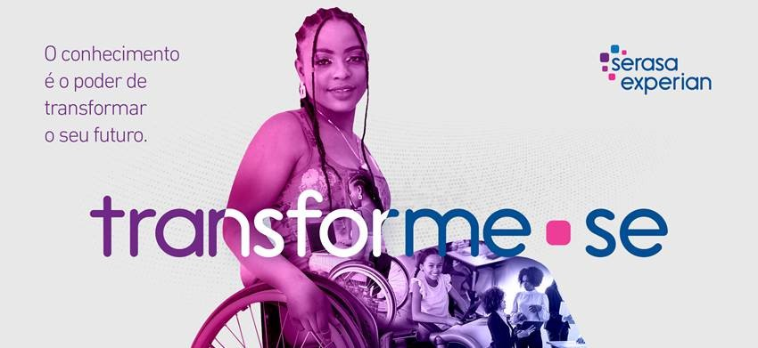

<h1 align="center">Transforme-se PcD | Módulo Python</h1>

## Projeto realizado pelo Programa Transforme-se da Serasa Experian e Wise Hands!
***
> #### O programa Transforme-se é uma parceria da Serasa Experian com a Wise Hands e tem como objetivo estimular o aprendizado de PcD.

***

## As atividades e os projetos do Módulo Python, Com a orientação do Professor [Diego Alves](https://github.com/diegoalvesone).

## Índice

1. [Atividades](./Exercicio)
   * [Exercicio 01](./Exercicio/exercicio01.py)
   * [Exercicio 02](./Exercicio/exercicio02.py)
   * [Exercicio 03](./Exercicio/exercicio03.py)
   * [Exercicio 04](./Exercicio/exercicio04.py)
2. [Projetos](./Projeto%20Jogo%20de%20Adivinhação/)
   * [Jogo de Adivinhação](./Projeto%20Jogo%20de%20Adivinhação/jogo-adivinhacao.py)

3. [Praticas nas Aulas](./Pratica%20na%20Aula/)
   * [Estruturas Condicionais](./Pratica%20na%20Aula/Estruturas%20Condicionais/estruturas-condicionais.py)
   * [Estruturas de Repetição](./Pratica%20na%20Aula/Estruturas%20de%20Repetição/)
     * [For](./Pratica%20na%20Aula/Estruturas%20de%20Repetição/for.py)
     * [While](./Pratica%20na%20Aula/Estruturas%20de%20Repetição/while.py)
   * [Operadores](./Pratica%20na%20Aula/Operadores/)
     * [Operadores Aritmeticos](./Pratica%20na%20Aula/Operadores/operadores-aritmeticos.py)
     * [Operadores Relacionais](./Pratica%20na%20Aula/Operadores/operadores-relacionais.py)
   * [Programação Orientada a Objetos - POO](./Pratica%20na%20Aula/POO/)
     * [Definição da classe](./Pratica%20na%20Aula/POO/cachorro.py)
     * [Herança e Polimorfismo](./Pratica%20na%20Aula/POO/conta_bancaria_final.py)
     * [Solução orientada a objetos para um banco](./Pratica%20na%20Aula/POO/conta-bancaria.py)
       * [Criando uma instância da classe](./Pratica%20na%20Aula/POO/main.py)
   * [Tipo de Dados](./Pratica%20na%20Aula/Tipo%20de%20Dados/)
     * [Dicionario](./Pratica%20na%20Aula/Tipo%20de%20Dados/dicionario.py)
     * [Lista](./Pratica%20na%20Aula/Tipo%20de%20Dados/lista.py)
     * [Numeros](./Pratica%20na%20Aula/Tipo%20de%20Dados/numeros.py)
     * [Strings](./Pratica%20na%20Aula/Tipo%20de%20Dados/strings.py)
     * [Tuplas](./Pratica%20na%20Aula/Tipo%20de%20Dados/tuplas.py)
     * [Variavel](./Pratica%20na%20Aula/Tipo%20de%20Dados/variavel.py)
  
***
## Referência
 
 - [Variaveis - String - Numeros](./File/pdf/Variaveis-string-numeros.pdf) 
 - [Listas - Tuplas - Dicionarios](./File/pdf/Listas-Tuplas-Dicionarios-atualizado.pdf)
 - [Estruturas - Operadores](./File/pdf/Estruturas-operadores-python.pdf)
 - [Programação Orientada a Objetos - POO](./File/pdf/POO.pptx%20(1).pdf)

******
## Licença

________________

****
 

